# Título:
Blog Pessoal

**Versão:** 1.1

**Link da aplicação:** https://taymayarablog.vercel.app/

# Descrição:
Aplicação de blog onde os artigos são carregados dinamicamente com rotas personalizadas, dados buscados via API (simulação do crudcrud) e aplicação de boas práticas de SEO utilizando App Router do Next.js.

O projeto implementa:

- Renderização dinâmica de conteúdo
- Rotas dinâmicas ([slug])
- Integração com API externa
- Estratégias de fallback para garantir resiliência
- Otimizações de performance com Lighthouse e PageSpeed Insights

# CI/CD
O projeto utiliza GitHub Actions para:

- Validação de código (ESLint);
- Testes automatizados (Jest);
- Build da aplicação (Next.js);
- Deploy automático no Vercel (CD).

Fluxo: push -> CI -> CD -> deploy

# Tecnologias utilizadas:
- Next.js
- TypeScript
- Node.js
- CSS Modules

# Segurança:
Algumas vulnerabilidades moderadas permanecem em dependências indiretas (Jest e ferramentas internas). Optou-se por não utilizar "npm audit fix --force" para evitar possíveis quebras na aplicação.

# Instalação:

bash:
- git clone https://github.com/tayanibritto/taymayarablog.git
- cd taymayarablog
- npm install
- npm run dev
- Acessar no navegador: http://localhost:3000

# Requisitos:

- Node.js instalado
- Criar uma API nova no https://crudcrud.com
- Configurar '.env.local': Verificar ao final deste documento, no título 'Observações'.
- Necessário acesso à internet

# Estrutura do Projeto:

- .github/
    - workflows/
        - deploy.yml
        - main.yml
- public/
    - erro.webp
    - logo.webp
    - not-found.webp
    - separador.webp
- src/
    - __tests__
        - CreatePost.test.tsx
        - slug.test.ts
    - app/
        - api/
            - route.ts
        - artigos/
            - [slug]/
                - page.module.css
                - page.tsx
            - novo/
                - page.module.css
                - page.tsx
        - contato/
            - page.module.css
            - page.tsx
        - sobre/
            - page.tsx
        - error.tsx
        - global.module.css
        - layout.tsx
        - loading.tsx
        - main.module.css
        - not-found.tsx
        - page.tsx
    - components/
        - CreatePost.module.css
        - CreatePost.tsx
        - Footer.module.css
        - Footer.tsx
        - Header.module.css
        - Header.tsx
    - lib/
        - crudcrud.ts
        - mockPosts.ts
.gitignore
AGENTS.md
CLAUDE.md
eslint.config.mjs
jest.config.mjs
jest.setup.ts
next.config.ts
package-lock.json
package.json
tsconfig.json
tsconfig.test.json

# Análise de Performance (Lighthouse)

## Análise Inicial - ANTES DA ATUALIZAÇÃO

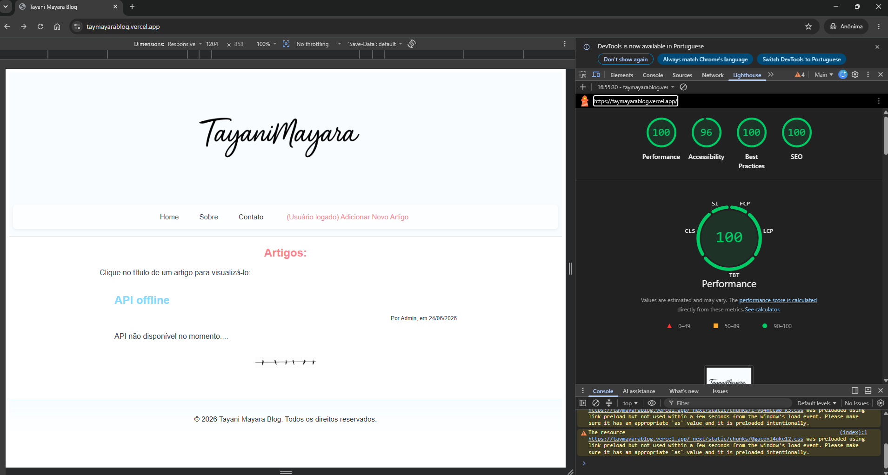
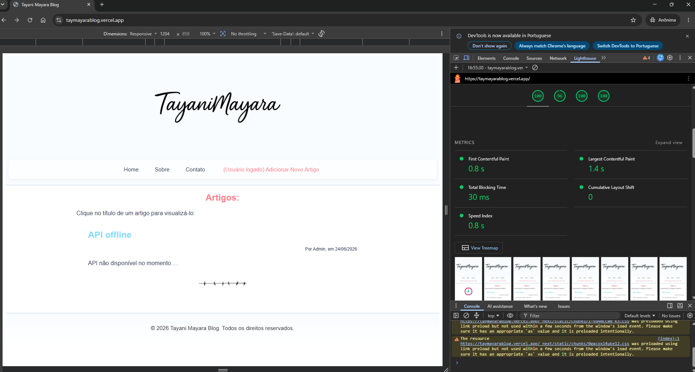
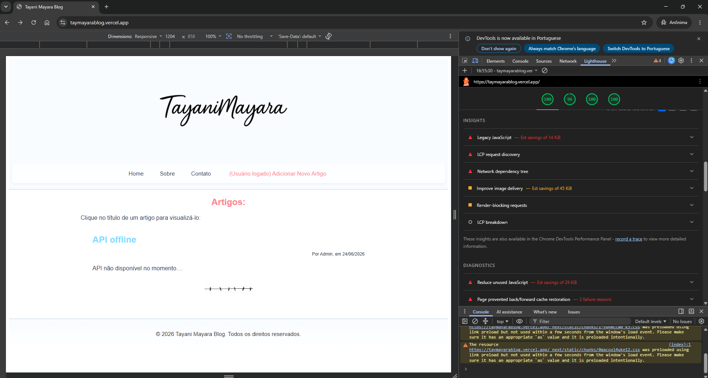
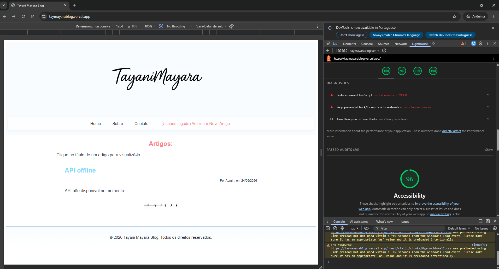
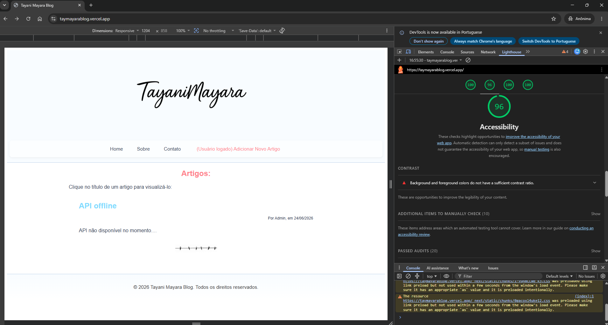

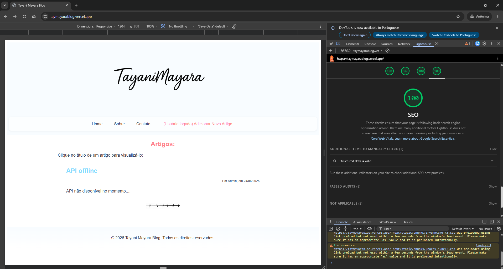

Link do relatório do PageSpeed Insights: https://pagespeed.web.dev/analysis/https-taymayarablog-vercel-app/uyf9y0tpnk?form_factor=desktop

- Métricas Principais do Lighthouse:
1. FCP: 0.8s
2. LCP: 1.4s
3. TBT: 30ms
4. CLS: 0
5. Speed Index: 0.8s

- Performance:
1. CSS bloqueando renderização: Pequenos arquivos (~1KB). Impacto não crítico.
2. LCP ligado à logo: Necessidade de priorizar carregamento. Ponto relevante.
3. JavaScript não utilizado (~29KB): Comportamento esperado do Next.js.
4. JavaScript legado: Garantia de compatibilidade. Não se trata de um problema real.
5. CLS baixo: (~0.004): Layout já estava estável.

- Acessibilidade:
1. Contraste insuficiente em alguns elementos.
2. Impacto direto na leitura de conteúdo.
Trata-se de pontos muito relevantes.

- Práticas Recomendadas:
1. CSP, COOP e headers HTTP não configurados: Não foi abordado por fugir do escopo do front-end.
2. Avisos de preload de CSS: Comportamento esperado do Next.js.

- SEO:
1. Estrutura já adequada.
2. Sem necessidade de correções.

## Melhorias Aplicadas

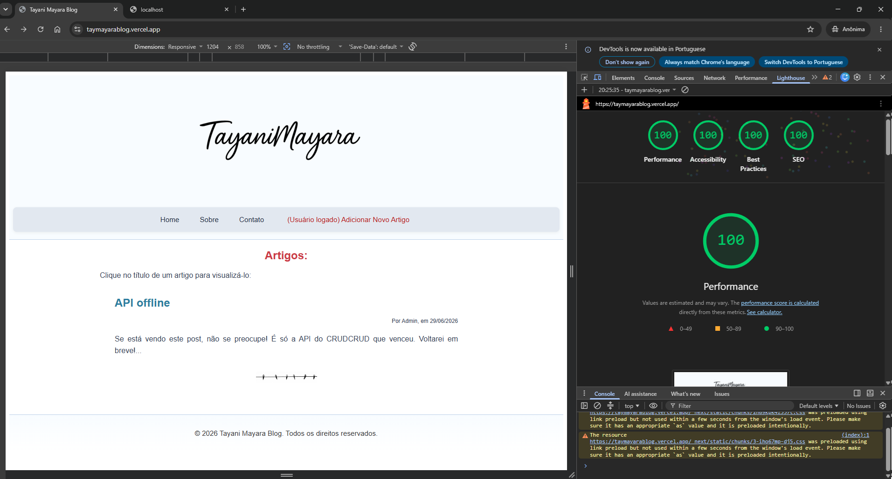
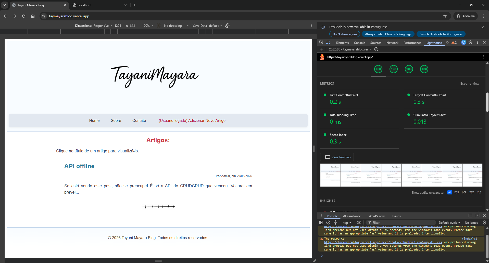
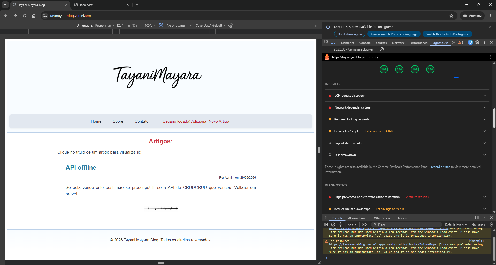
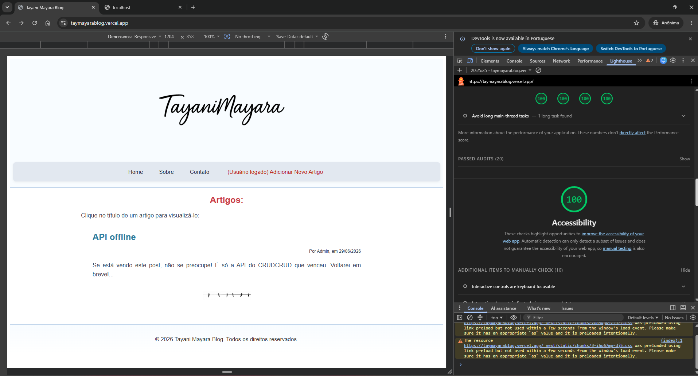
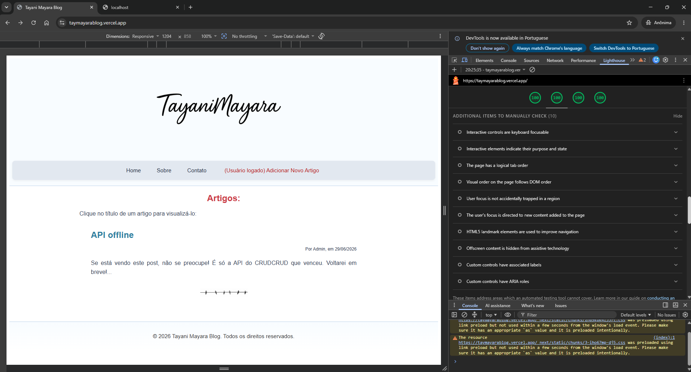
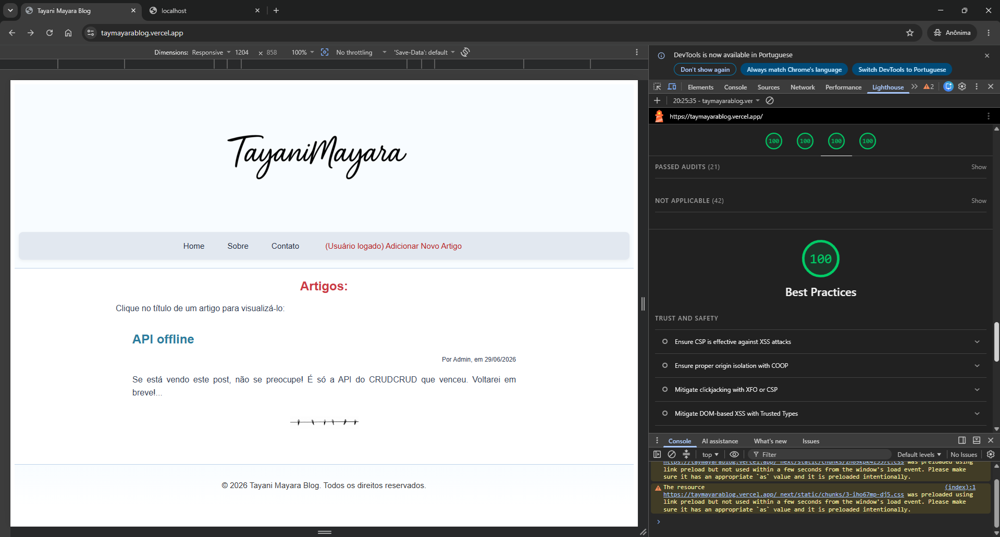
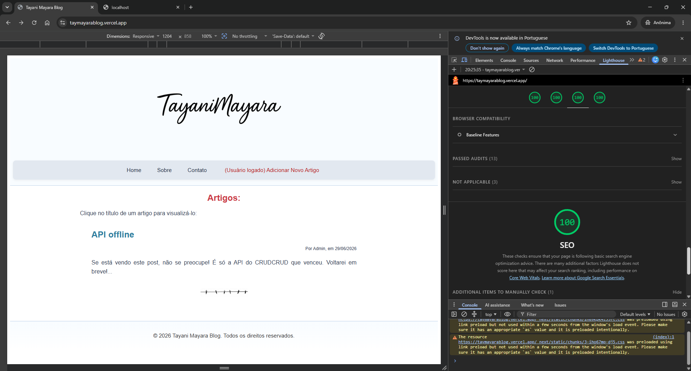
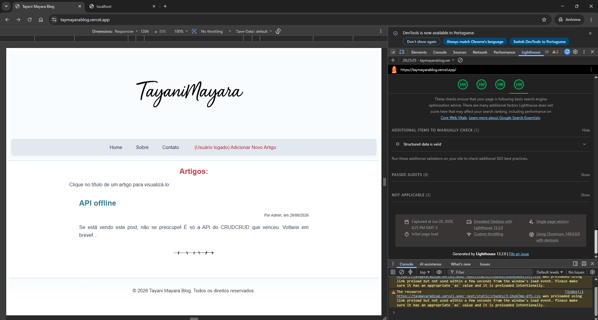

Link do relatório do PageSpeed Insights: https://pagespeed.web.dev/analysis/https-taymayarablog-vercel-app/wlqt5kjjp2?form_factor=desktop

- Performance:
1. Otimização de todas as imagens, convertendo arquivos .png e .jpg para .webp, com especial atenção para a logo, que foi redimensionada para um tamanho mais adequado ao layout.
2. Uso de 'priority' no componente <Image /> da logo.
3. Ajustes de sizes para responsividade da logo.
4. Redução de CSS duplicado, centralizando essas configurações no 'global.module.css'.
5. Tratamento de fallback para API, para evitar carregamento infinito ou tela bruta de erro, o que pode acontecer facilmente, por se tratar de uma API que é excluída em 24h após sua geração.

- Acessibilidade:
1. Ajuste de contraste de cores.
2. Garantia de legibilidade dos textos.

- Estabilidade:
1. Ajuste de layout de 'loading.tsx', para causar menor impacto de shift na aplicação após carregamento dos posts. O shift não foi completamente eliminado, uma vez que a página de carregamento dificilmente alcançará o mesmo tamanho da tela de posts.

## Análise Final - APÓS AS CORREÇÕES

- Resultado final Lighthouse e PageSpeed Insights:
1. 100 em todos os requisitos avaliados: Performance, Acessibilidade, Best Practices e SEO.

- Métricas principais do Lighthouse:
1. FCP: 0.2s
2. LCP: 0.3s
3. TBT: 0ms
4. CLS: 0.012
5. Speed Index: 0.3s

- Comparação Antes e Depois
1. Performance: Continuou em 100.
2. CLS: Mantém-se estável após as otimizações realizadas, com valores próximos do zero. Pequenas variações podem ocorrer dependendo do ambiente de execução e do momento da análise, principalmente em cenários com conteúdo dinâmico e uso de estados de loading. 
3. Acessibilidade: De 96 foi para 100 devido ao aumento de contraste, o que facilita a leitura.
4. Práticas Recomendadas: Continuou em 100.
5. Organização do CSS: Estava boa devido à utilização do CSS Modules, mas melhorou após a centralização de configurações duplicadas.

- Principais Melhorias de Impacto
1. CLS: Ajuste da página 'loading.tsx', para garantir consistência de layout entre estado de carregamento e página carregada.
2. LCP: Uso de 'priority' na imagem da logo, ajuste de 'sizes' e redução do tamanho da imagem, o que reduz significativamente o tempo de carregamento.
3. Refatoração de CSS: Remoção de duplicação, centralização de estilos e redução de arquivos carregados.
4. Tratamento de fallback da API: Evita falhas durante o build.

## Conclusão

O projeto já apresentava boas métricas, porém foi aprimorado com foco em performance, estabilidade visual, organização de CSS e acessibilidade.

Durante o processo, observou-se que as tentativas excessivas de micro-otimização podem gerar efeitos colaterais, como aumento do CLS. Dessa forma, foi adotada uma abordagem equilibrada:
- Priorização da experiência do usuário.
- Manutenção da estabilidade visual.
- Otimização baseada em impacto real.

## Resultado Final

Na nova versão, o projeto atingiu alto desempenho, código organizado e escalável, boa experiência do usuário e pronto para produção.

# Observações:
Para que a aplicação funcione corretamente, é necessário configurar as variáveis de ambiente utilizadas na integração com a API do CrudCrud.

1. Crie um arquivo chamado '.env.local' na raiz do projeto.
2. Adicione o seguinte conteúdo:
    - NEXT_PUBLIC_API_URL=https://crudcrud.com/api
    - NEXT_PUBLIC_CRUD_API_KEY=SUA_CHAVE_AQUI
    - NEXT_PUBLIC_CRUD_API_COLLECTION=posts

## Importante:

1. A chave é única e expira após um período de mais ou menos 24h.
2. Mesmo expirando, não é recomendado compartilhar sua chave publicamente.
3. O arquivo '.env.local' não é versionado. Está incluído no '.gitignore'.